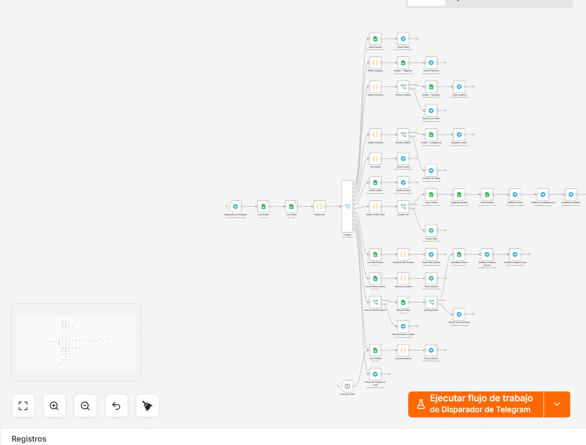
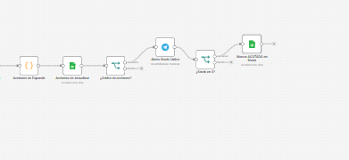
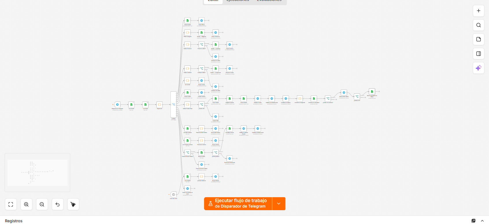
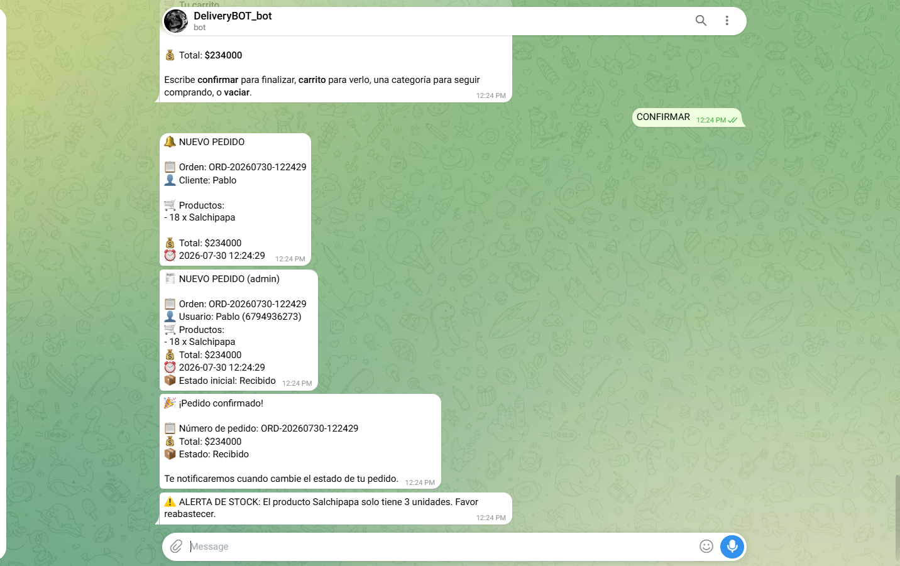
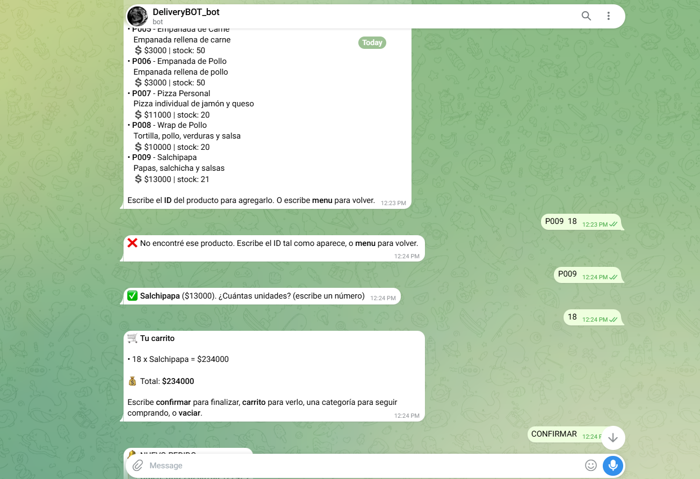

# ⚠️ Sistema de Alerta de Stock Crítico

---

## 📋 Descripción

Este proyecto consiste en la implementación de un **Sistema de Alerta de Stock Crítico** desarrollado mediante **n8n**, **Telegram** y **Google Sheets**.

El sistema se integra al flujo principal de pedidos de **DeliveryBot** y permite monitorear automáticamente la cantidad disponible de cada producto después de realizar una compra.

Cuando el stock de un producto llega a una cantidad crítica, el sistema envía una alerta automática al administrador mediante Telegram 📱.

Además, cuando un producto llega a **0 unidades**, el sistema lo marca automáticamente como **(AGOTADO)** dentro de la hoja **Menú** de Google Sheets 📊.

El flujo de actualización utiliza la hoja **Menú** y actualiza el stock de cada producto después de confirmar un pedido. :contentReference[oaicite:0]{index=0}

---

# 🎯 Objetivos

---

- 📦 Monitorear automáticamente el stock de los productos.
- ⚠️ Detectar cuando un producto tiene una cantidad crítica.
- 📱 Enviar alertas automáticas al administrador mediante Telegram.
- 🔢 Verificar si el stock es menor o igual a **3 unidades**.
- 🚫 Detectar cuando un producto llega a **0 unidades**.
- 📝 Marcar automáticamente los productos agotados.
- 📊 Mantener actualizada la información del inventario en Google Sheets.
- 🤖 Evitar que se realicen pedidos de productos sin disponibilidad.
- ⚡ Reducir el control manual del inventario.

---

# 🛠️ Tecnologías Utilizadas

---

| Tecnología | Función |
|---|---|
| ⚙️ **n8n** | Automatización y ejecución del flujo |
| 📱 **Telegram** | Envío de alertas al administrador |
| 📊 **Google Sheets** | Almacenamiento y actualización del inventario |
| 🤖 **DeliveryBot** | Sistema principal donde se integra la alerta |
| 🧠 **JavaScript** | Procesamiento de datos dentro de algunos nodos |

---

# 🖼️ Imágenes

---

### 🔄 Flujo Anterior

---



---

### 🆕 Flujo Nuevo

---

Se agregaron nuevos nodos justo después de **Actualizar Stock**:

- ⚠️ **Stock Crítico?**
- 📱 **Alerta Stock Crítico**
- 🚫 **¿Stock en 0?**
- 📝 **Marcar AGOTADO en Menú**








---

# ⚙️ Nodos Nuevos

---

## ⚠️ Stock Crítico?

Este nodo utiliza una condición de tipo **IF** para comprobar si el nuevo stock del producto es menor o igual a **3 unidades**.

La condición utilizada es:

```text
nuevoStock <= 3
---

# 📁 Estructura del Proyecto

---

```text
📦 n8n_Stock-Critico
│
├── 📄 README.md
│
├── 🖼️ image.png
│   └── Captura del flujo anterior
│
├── 🖼️ image-1.png
│   └── Captura del flujo nuevo
│
├── 🖼️ image-2.png
│   └── Captura de los nodos nuevos
│
└── ⚙️ Workflow de n8n
    │
    ├── 📊 Actualizar Stock
    │
    ├── ⚠️ Stock Crítico?
    │   └── Verifica si el stock es menor o igual a 3
    │
    ├── 📱 Alerta Stock Crítico
    │   └── Envía una notificación al administrador
    │
    ├── 🚫 ¿Stock en 0?
    │   └── Verifica si el stock llegó a 0
    │
    └── 📝 Marcar AGOTADO en Menú
        └── Agrega el estado (AGOTADO) al producto